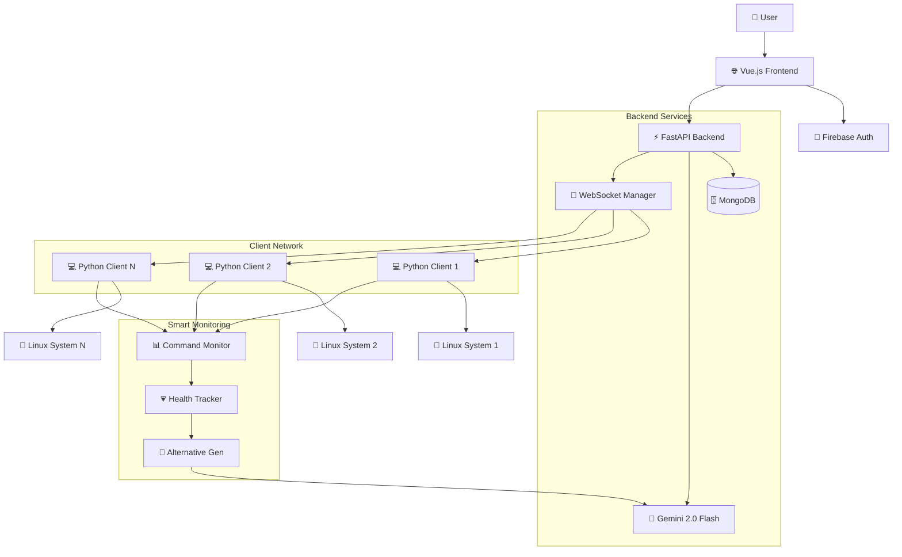

# AI Linux Agent - Complete System Architecture & Flow Documentation

## 🎯 **System Overview**

The AI Linux Agent is a sophisticated **distributed remote command execution system** that combines modern web technologies with artificial intelligence to provide intelligent Linux system management across multiple machines. The system enables users to execute complex commands, monitor systems, and manage multiple Linux clients through a unified web dashboard with real-time AI assistance.

## 🏗️ **Architecture Components**

### **Three-Tier Architecture**
```
┌─────────────────────────────────────────────────────────────────┐
│                     AI Linux Agent System                      │
├─────────────────┬─────────────────┬─────────────────────────────┤
│   Vue.js        │   FastAPI       │   MongoDB                   │
│   Frontend      │   Backend       │   Database                  │
│   - Dashboard   │   - API Server  │   - User Management         │
│   - Auth UI     │   - WebSocket   │   - Client Registry         │
│   - Live Term   │   - LLM Integ   │   - Task History            │
└─────────────────┼─────────────────┼─────────────────────────────┘
                  │                 │
                  │ Real-time Communication
                  │
    ┌─────────────▼─────────────────────────────────────┐
    │              Python Clients                       │
    │  ┌─────────────┐ ┌─────────────┐ ┌─────────────┐  │
    │  │   Client 1  │ │   Client 2  │ │   Client N  │  │
    │  │ (Ubuntu)    │ │ (CentOS)    │ │ (Docker)    │  │
    │  │ - Exec Cmds │ │ - Exec Cmds │ │ - Exec Cmds │  │
    │  │ - Report    │ │ - Report    │ │ - Report    │  │
    │  │ - Monitor   │ │ - Monitor   │ │ - Monitor   │  │
    │  └─────────────┘ └─────────────┘ └─────────────┘  │
    └─────────────────────────────────────────────────┘
```

### **Core Technologies**
- **Frontend**: Vue.js 3 + Tailwind CSS + Pinia
- **Backend**: FastAPI + WebSockets + MongoDB
- **AI Engine**: Google Gemini 2.0 Flash
- **Authentication**: Firebase Auth + API Keys
- **Communication**: Real-time WebSocket messaging
- **Clients**: Python 3.8+ with AsyncIO

## 📊 **Complete System Flow Diagram**



## 🔄 **Detailed Workflow Documentation**

### **1. User Authentication & Authorization Flow**
```
User Login → Firebase Auth → Backend Validation → API Key Generation → Dashboard Access → WebSocket Connection
```

**Step-by-Step Process:**
1. **User Authentication**: User logs in via Firebase (Google/email)
2. **Token Validation**: Backend validates Firebase ID token
3. **API Key Generation**: Unique API key generated and stored
4. **Dashboard Access**: User granted access to management interface
5. **WebSocket Connection**: Real-time connection established for live updates

**Key Files:**
- `frontend/src/stores/auth.js` - Pinia auth state management
- `frontend/src/services/firebase.js` - Firebase client integration
- `backend/app/routers/auth.py` - Authentication endpoints
- `backend/utils/auth.py` - Auth validation utilities
- `backend/config/firebase.py` - Firebase admin configuration

### **2. Client Registration & Management Flow**
```
Client Start → System Detection → HTTP Registration → WebSocket Handshake → Persistent Connection → Heartbeat Loop
```

**Step-by-Step Process:**
1. **System Discovery**: Client collects system information (OS, architecture, hostname)
2. **Machine ID Generation**: Persistent unique identifier created/loaded
3. **HTTP Registration**: Client registers with backend via REST API
4. **WebSocket Connection**: Real-time bidirectional communication established
5. **Heartbeat Monitoring**: Periodic health checks maintain connection
6. **Status Updates**: System information updates sent regularly

**Key Files:**
- `client/src/client.py` - Main client application and communication
- `client/src/system_info.py` - System information collector
- `client/src/machine_id.py` - Persistent machine identification
- `backend/app/routers/clients.py` - Client management API endpoints
- `backend/app/routers/websocket.py` - WebSocket connection management

### **3. AI-Powered Task Execution Flow**
```
User Command → AI Decomposition → Task Storage → Command Distribution → Smart Execution → Real-time Streaming → Result Validation → AI Summary
```

**Detailed Execution Steps:**
1. **User Input Processing**: User enters natural language request or specific command
2. **AI Task Decomposition**: Gemini 2.0 Flash analyzes and breaks down complex requests into executable subtasks
3. **Task Persistence**: Complete task structure stored in MongoDB with metadata
4. **Command Distribution**: First subtask sent to target client via WebSocket
5. **Enhanced Execution**: Smart command executor handles execution with monitoring
6. **Live Output Streaming**: Real-time command output streamed to dashboard
7. **Intelligent Validation**: AI validates success/failure beyond simple exit codes
8. **Progressive Execution**: Successful subtasks trigger next step automatically
9. **Comprehensive Summary**: AI generates final summary of complete task execution

**Key Files:**
- `backend/utils/llm_service.py` - Core AI integration and task decomposition
- `backend/app/routers/tasks.py` - Task management and lifecycle
- `client/src/enhanced_command_executor.py` - Intelligent command execution
- `frontend/src/views/TaskDetailsModern.vue` - Real-time execution display
- `backend/models/user.py` - Task and execution data models

### **4. Smart Monitoring & Recovery Flow**
```
Command Start → Process Monitoring → Health Analysis → Hanging Detection → Alternative Generation → Automatic Recovery → Success/Failure Report
```

**Intelligence Features:**
1. **Process Health Monitoring**: Continuous monitoring of CPU, memory, I/O activity
2. **Adaptive Timeout Management**: Different strategies based on command classification
3. **Hanging Detection**: Identify truly stuck processes vs. legitimate long-running operations
4. **AI Alternative Generation**: Generate contextually appropriate alternative commands
5. **Automatic Recovery**: Execute alternatives when primary commands fail
6. **Learning Integration**: Track successful patterns for future improvements

**Key Files:**
- `client/src/smart_command_monitor.py` - Intelligent process monitoring
- `client/src/enhanced_command_executor.py` - Enhanced execution with recovery
- `backend/utils/llm_service.py` - Alternative command generation
- `backend/app/routers/commands.py` - Command analysis utilities

## 📁 **Comprehensive File Structure & Responsibilities**

### **Frontend Architecture (Vue.js)**
```
frontend/
├── src/
│   ├── App.vue                    # Root application component, WebSocket lifecycle
│   ├── main.js                    # Vue 3 app initialization, Pinia setup
│   ├── components/                # Shared UI components
│   │   ├── ClientCard.vue         # Client status display component
│   │   ├── TaskCard.vue           # Task summary component
│   │   └── LiveTerminal.vue       # Real-time terminal output component
│   ├── views/
│   │   ├── Login.vue             # Firebase authentication interface
│   │   ├── Dashboard.vue         # Main dashboard with overview metrics
│   │   ├── Clients.vue           # Client management and monitoring
│   │   ├── Tasks.vue             # Task list and history management
│   │   ├── TaskDetails.vue       # Basic task details view
│   │   └── TaskDetailsModern.vue # Advanced real-time task execution view
│   ├── services/
│   │   ├── api.js                # Axios HTTP client with interceptors
│   │   ├── firebase.js           # Firebase auth integration
│   │   └── websocket.js          # WebSocket communication manager
│   ├── stores/
│   │   └── auth.js               # Pinia authentication state management
│   ├── router/
│   │   └── index.js              # Vue Router with auth guards
│   └── utils/
│       ├── dateFormat.js         # Date/time formatting utilities
│       └── commandHelpers.js     # Command processing helpers
├── package.json                   # Dependencies, scripts, dev tools
├── tailwind.config.js            # Tailwind CSS configuration
├── vite.config.js                # Vite build tool configuration
└── index.html                    # Application entry point
```

### **Backend Architecture (FastAPI)**
```
backend/
├── app/
│   ├── main.py                   # FastAPI app initialization, middleware, routing
│   ├── middleware.py             # Security, CORS, logging, rate limiting
│   └── routers/
│       ├── __init__.py           # Router package initialization
│       ├── auth.py               # Firebase authentication endpoints
│       ├── clients.py            # Client registration, management, monitoring
│       ├── tasks.py              # Task creation, execution, history
│       ├── commands.py           # Command utilities, alternatives, analysis
│       └── websocket.py          # WebSocket handlers, real-time communication
├── config/
│   ├── __init__.py               # Configuration package
│   ├── database.py               # MongoDB connection and configuration
│   └── firebase.py               # Firebase admin SDK setup
├── models/
│   ├── __init__.py               # Models package
│   └── user.py                   # Pydantic models for users, tasks, clients
├── utils/
│   ├── __init__.py               # Utils package
│   ├── auth.py                   # Authentication utilities and middleware
│   ├── llm_service.py            # AI/LLM integration with Gemini 2.0 Flash
│   └── security.py               # Security utilities, command validation
└── requirements.txt              # Python dependencies
```

### **Client Architecture (Python Agent)**
```
client/
├── src/
│   ├── __init__.py               # Package initialization
│   ├── client.py                 # Main client application and communication
│   ├── system_info.py            # System information collection utilities
│   ├── machine_id.py             # Persistent machine ID generation/management
│   ├── command_executor.py       # Basic command execution with safety checks
│   ├── enhanced_command_executor.py # Smart execution with monitoring integration
│   └── smart_command_monitor.py  # Intelligent process monitoring and health analysis
├── config/
│   └── default.json              # Default client configuration
├── run_client.py                 # Client startup script with argument parsing
├── requirements.txt              # Python dependencies
└── README.md                     # Client-specific documentation
```

## 🚀 **Core Features & Capabilities**

### **AI-Powered Intelligence**
- **Advanced Task Decomposition**: Complex natural language requests broken into executable command sequences
- **Context-Aware Validation**: AI understands command intent and validates success beyond exit codes
- **Intelligent Alternative Generation**: Automatic alternative commands when primary execution fails
- **Smart Command Classification**: Different handling strategies for different types of operations
- **Comprehensive AI Summaries**: Detailed analysis and explanation of task execution results

### **Real-time Communication Architecture**
- **Bidirectional WebSocket Messaging**: Full-duplex communication between all components
- **Live Output Streaming**: Character-by-character command output streaming
- **Interactive Command Support**: Handle commands requiring user input (sudo, passwords, confirmations)
- **Connection Health Management**: Automatic reconnection, heartbeat monitoring, graceful degradation
- **Multi-client Orchestration**: Simultaneous management of multiple Linux machines

### **Security & Safety Framework**
- **Multi-layer Authentication**: Firebase + API key dual authentication system
- **Command Safety Validation**: Automatic blocking of dangerous system operations
- **API Rate Limiting**: Prevent abuse with configurable request limits
- **Input Sanitization**: Comprehensive validation of all user inputs
- **Process Isolation**: Commands execute in isolated process groups with timeouts
- **Audit Logging**: Complete audit trail of all operations and access patterns

### **Smart Monitoring System**
- **Intelligent Hanging Detection**: Identify stuck commands within 30-45 seconds
- **Resource Usage Monitoring**: Real-time CPU, memory, and I/O activity tracking
- **Adaptive Timeout Strategies**: Different timeout behaviors based on command classification
- **Health State Classification**: HEALTHY, IDLE, HANGING, WAITING_INPUT, ERROR_LOOP states
- **Automatic Recovery**: Progressive intervention from warning to alternative execution

## 🔧 **Data Flow Patterns & Communication**

### **Command Execution Data Flow**
1. **Frontend** → HTTP POST `/api/tasks` → **Backend**
2. **Backend** → AI Task Decomposition → **Gemini 2.0 Flash**
3. **Backend** → Task Storage → **MongoDB**
4. **Backend** → WebSocket Command Message → **Target Client**
5. **Client** → Enhanced Command Execution → **Linux System**
6. **Client** → Real-time Output Streaming → **WebSocket** → **Frontend**
7. **Client** → Command Result + Metadata → **Backend**
8. **Backend** → AI Result Validation → **Gemini 2.0 Flash**
9. **Backend** → Database Update → **MongoDB**
10. **Backend** → WebSocket Status Update → **Frontend**
11. **Backend** → Next Subtask or AI Summary → **Client/Frontend**

### **Real-time Updates & Event Handling**
- **Live Output Events**: Character-by-character streaming with stream type identification
- **Health Monitoring Events**: Process metrics sent every 5-10 seconds during execution
- **Status Change Events**: Task state transitions pushed immediately to all connected clients
- **Alternative Command Events**: Notifications when hanging detected and alternatives triggered
- **Interactive Prompt Events**: Handle commands requiring user input with dashboard integration
- **Error and Recovery Events**: Comprehensive error reporting with suggested solutions

### **Database Schema Patterns**
```
Users Collection:
- user_id, firebase_uid, email, api_key, client_machines[]

Tasks Collection:
- task_id, user_id, machine_id, original_prompt, subtasks[], status, ai_summary

Clients Collection:
- machine_id, hostname, os_info, last_seen, is_active, system_metrics

Execution History:
- task_id, subtask_attempts[], validation_results[], alternative_attempts[]
```

## 🎯 **System Strengths & Technical Excellence**

### **Architecture Benefits**
- **Microservices Design**: Clean separation of concerns with independent scaling
- **Event-Driven Architecture**: Real-time responsiveness with WebSocket messaging
- **AI-First Integration**: Sophisticated LLM integration throughout the execution pipeline
- **Modern Technology Stack**: Vue 3 + FastAPI + MongoDB + Firebase for robust foundation
- **Async/Await Throughout**: Non-blocking operations for optimal performance

### **User Experience Excellence**
- **Intuitive Modern Dashboard**: Clean, responsive interface with real-time updates
- **Natural Language Processing**: Users can describe tasks in plain English
- **Multi-machine Single View**: Manage entire infrastructure from unified interface
- **Comprehensive Progress Tracking**: Real-time visibility into every aspect of execution
- **Intelligent Error Handling**: Automatic recovery with clear user communication

### **Operational & Maintenance Benefits**
- **Self-Healing Commands**: Automatic alternatives when primary commands fail
- **Comprehensive Security**: Multiple protection layers with ongoing threat mitigation
- **Horizontal Scalability**: Architecture supports growing numbers of clients and users
- **Complete Audit Trail**: Full logging and history for compliance and troubleshooting
- **Production-Ready Deployment**: Comprehensive deployment guide with Docker support

## 📈 **Performance & Scalability Characteristics**

### **Performance Optimizations**
- **WebSocket Connection Pooling**: Efficient real-time communication management
- **MongoDB Indexing**: Optimized queries for user data, tasks, and client information
- **Async Processing**: Non-blocking operations throughout the entire stack
- **Smart Caching**: Intelligent caching of AI responses and system information
- **Connection Management**: Efficient WebSocket lifecycle with automatic cleanup

### **Scalability Features**
- **Stateless Backend Design**: Horizontal scaling support for FastAPI instances
- **Database Sharding Ready**: MongoDB configuration supports future data partitioning
- **Client Load Distribution**: Smart distribution of tasks across available clients
- **Resource Monitoring**: Built-in metrics for capacity planning and optimization
- **CDN-Ready Frontend**: Static asset optimization for global distribution

## 🔮 **Future Enhancement Opportunities**

### **Planned Features**
- **Multi-tenant Support**: Enterprise-grade user isolation and resource management
- **Advanced Scheduling**: Cron-like scheduling with dependency management
- **File Transfer Integration**: Secure file upload/download capabilities
- **Mobile Application**: iOS/Android apps for monitoring and basic management
- **CI/CD Pipeline Integration**: Hooks for automated deployment and testing workflows

### **AI Enhancements**
- **Predictive Command Suggestions**: Learn from user patterns to suggest optimal commands
- **Anomaly Detection**: AI-powered detection of unusual system behavior or security threats
- **Performance Optimization Recommendations**: AI analysis of system performance with suggestions
- **Natural Language Query Interface**: Ask questions about system state in plain English
- **Automated Troubleshooting**: AI-guided resolution of common system issues

This AI Linux Agent represents a sophisticated, production-ready solution that successfully combines modern web technologies, artificial intelligence, and robust system administration practices into a unified, intelligent remote management platform.