# AI Linux Agent - Workflow Diagrams & Flow Charts

## 🔄 **Core System Workflows**

### **1. Complete User Journey Flow**

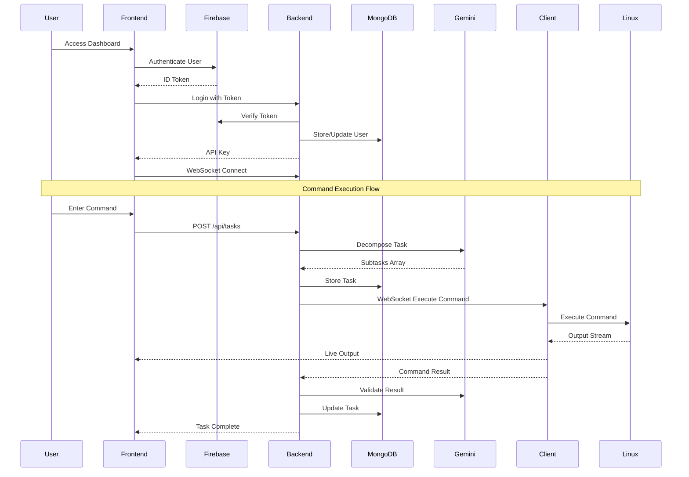

### **2. Client Registration & Management Flow**

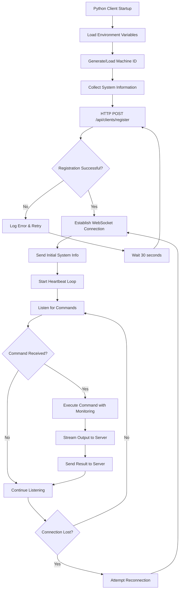

### **3. AI-Powered Task Decomposition Flow**

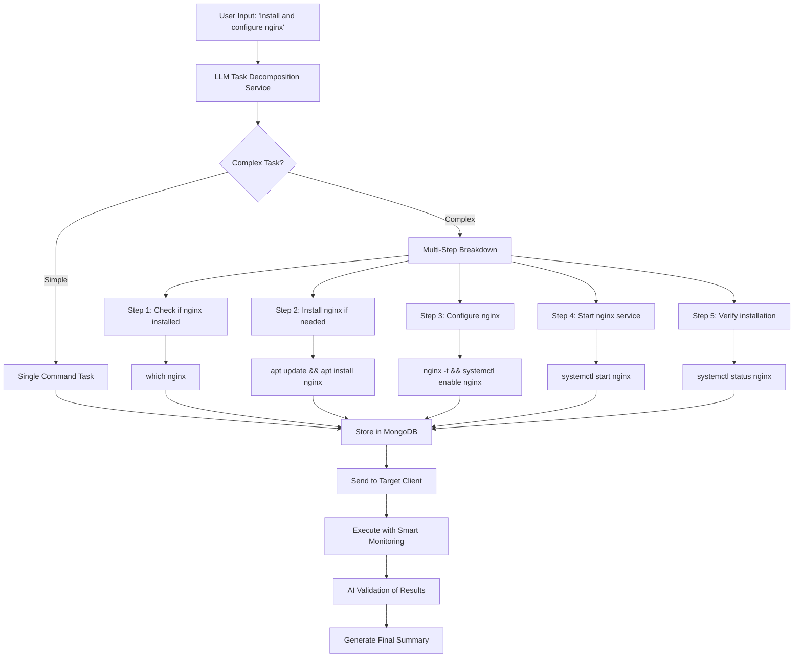

### **4. Smart Command Monitoring & Recovery Flow**

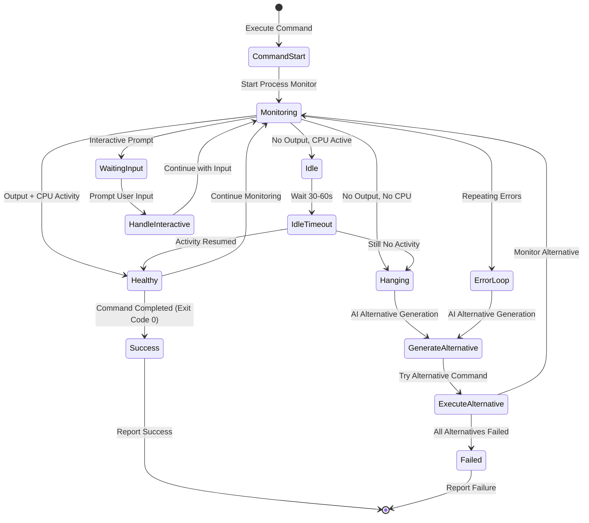

### **5. Real-time WebSocket Communication Flow**

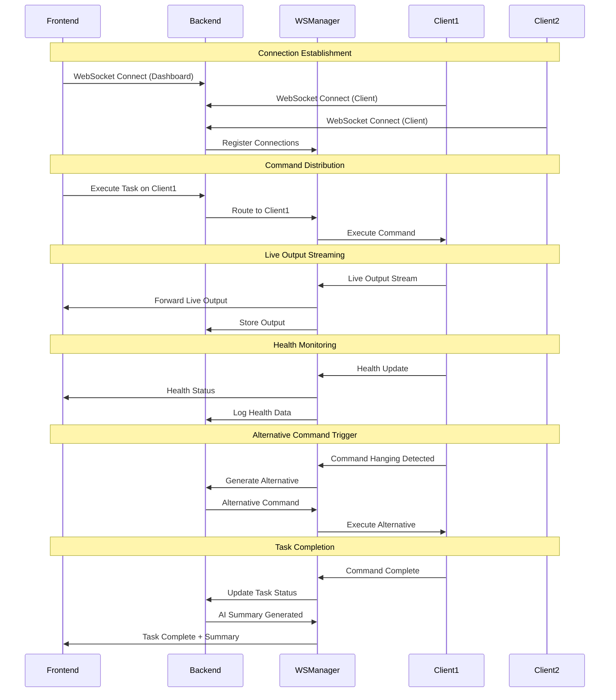

## 📊 **Data Flow Architecture Diagrams**

### **6. Complete Data Architecture**

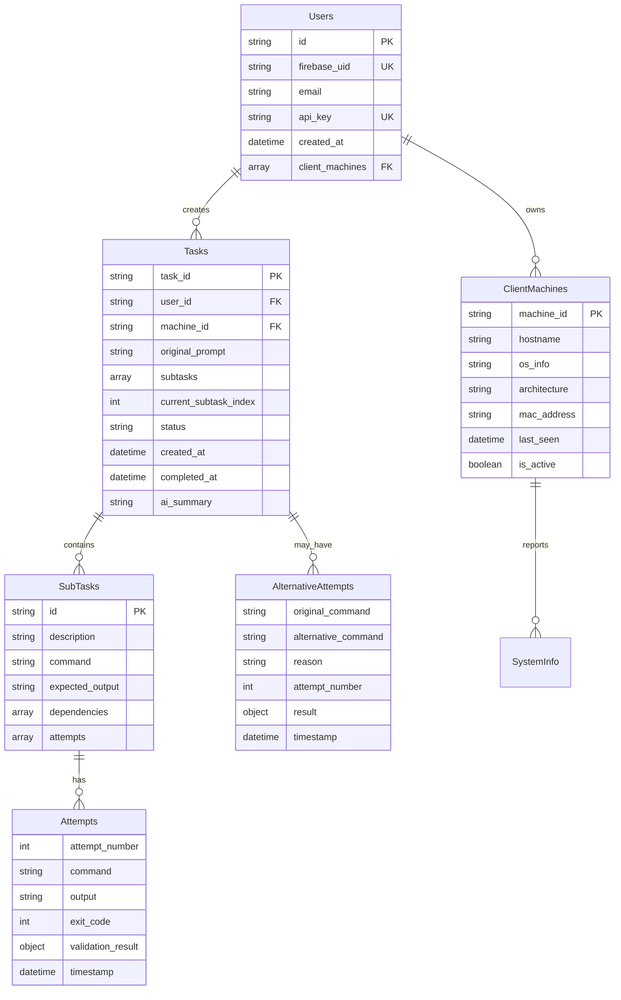

### **7. Security & Authentication Flow**

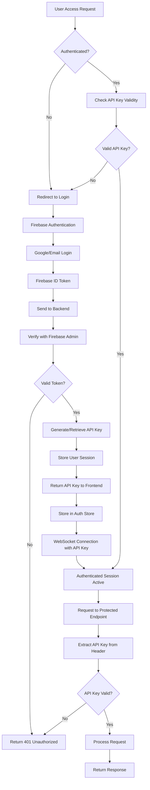

### **8. Command Safety & Validation Pipeline**

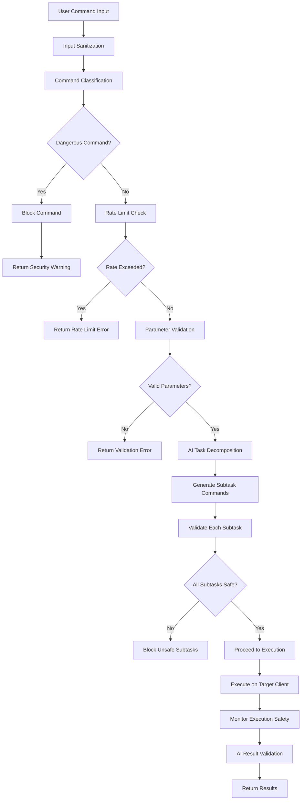

## 🚀 **Advanced Workflow Scenarios**

### **9. Multi-Client Task Orchestration**

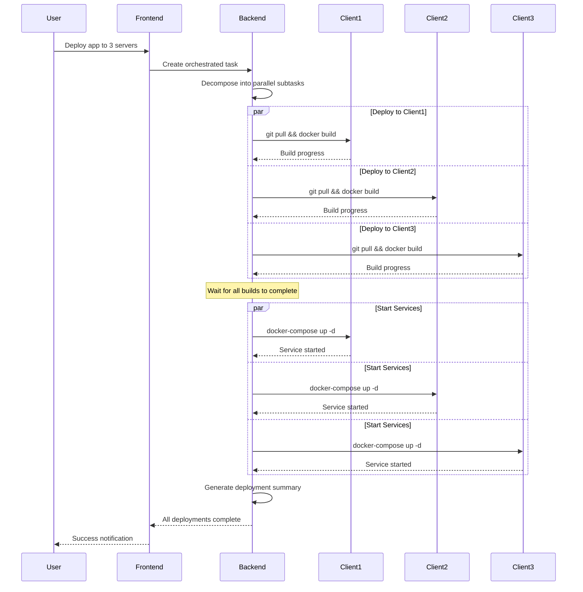

### **10. Error Handling & Recovery Workflow**

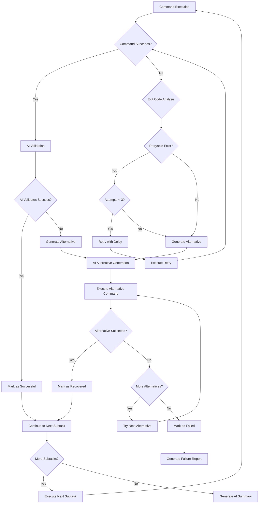

### **11. Interactive Command Handling Flow**

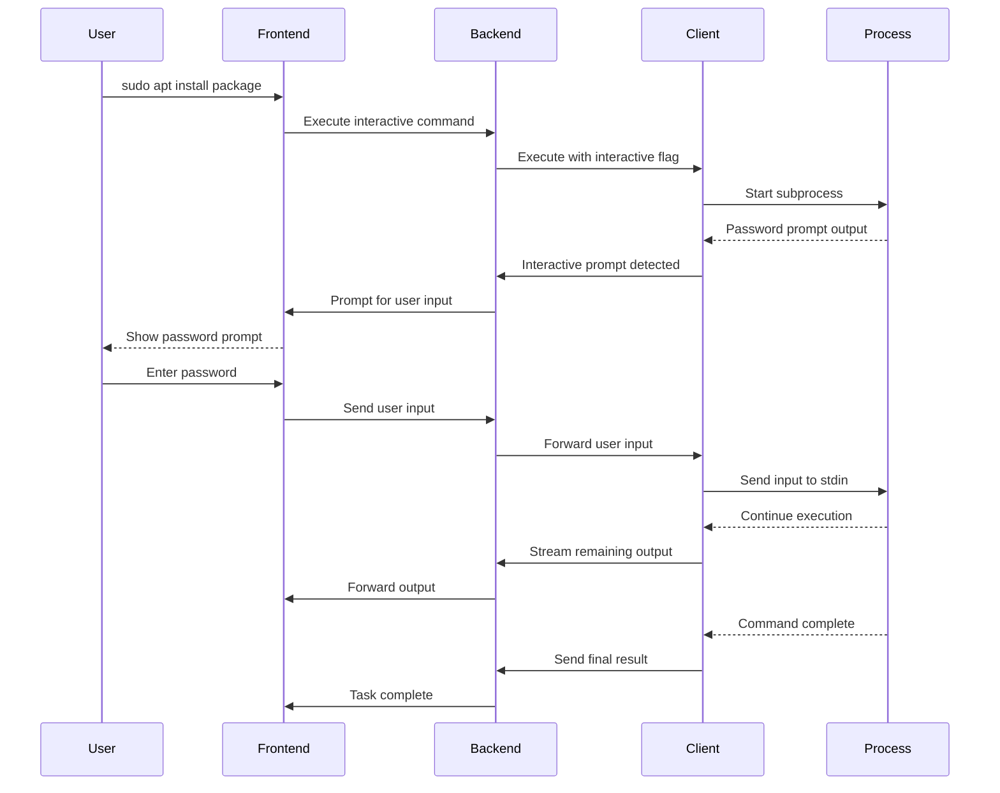

### **12. System Health Monitoring & Alerting**

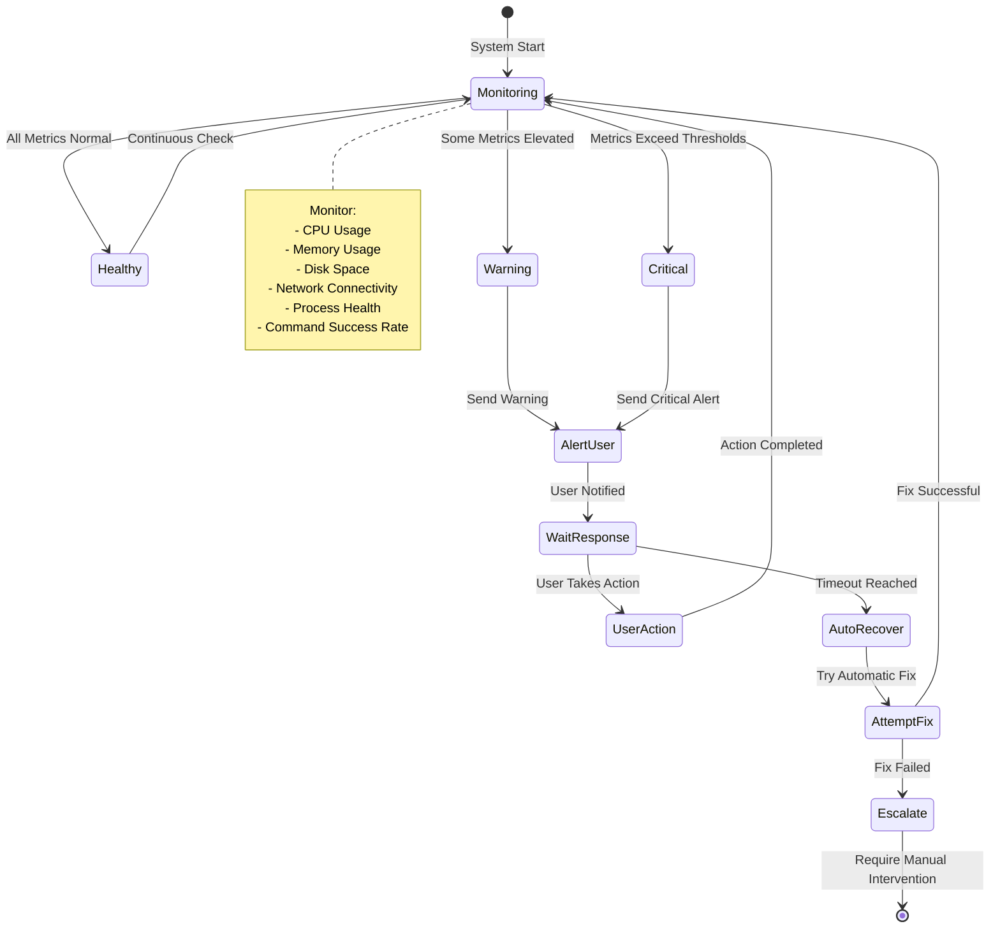

These workflow diagrams provide a comprehensive view of how your AI Linux Agent system operates, from high-level user interactions down to detailed technical processes. Each diagram illustrates the sophisticated coordination between components that makes your system both powerful and reliable.